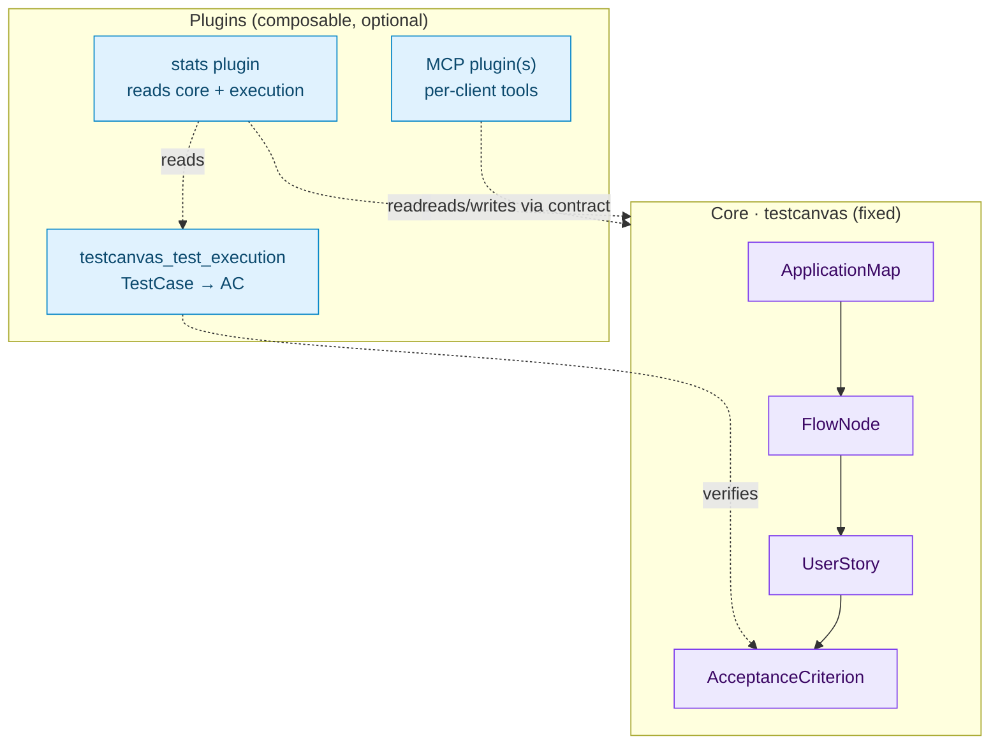

# ISTQB Strategy and Plugin Architecture

This document explains the design philosophy behind TestCanvas: how it models
testing assets following the **ISTQB** methodology, **why test execution lives in
a separate plugin**, and how the finished application is meant to be **composed
from plugins** according to each project's needs.

## The big picture

TestCanvas is not a monolithic test manager. It is a small, strict **core** that
captures the *test basis* — the tool-agnostic description of *what* must be
tested — surrounded by a belt of **optional plugins** that add *how* and *with
what* the testing actually happens.



The arrows only ever point **towards the core**: plugins know the core, the core
never knows the plugins.

## The ISTQB strategy

The core models the canonical ISTQB decomposition of the *test basis*:

```
ApplicationMap ──< FlowNode ──< UserStory ──< AcceptanceCriterion
```

| Layer | ISTQB meaning | Owned by |
|-------|---------------|----------|
| **ApplicationMap / FlowNode** | The application flow that acts as the *test basis* (graph of steps/states). | Core |
| **UserStory** | The behaviour expected at a flow node, in Agile/ISTQB form. | Core |
| **AcceptanceCriterion** | The measurable exit condition (optionally Given-When-Then). | Core |

The single job of the core is to **force these artefacts to be written in a
coherent, traceable way**:

- **Vertical traceability by code.** `UserStory.code` is unique and
  `AcceptanceCriterion` is unique per user story, so every criterion traces back
  to exactly one story and one flow node.
- **Structural invariants on the flow.** `FlowNode.clean()` enforces the
  pure/sub-flow rules (coherent `node_type`, no self-reference, single-level
  nesting, no cycles), keeping the flow graph well-formed.
- **Stable, global identifiers.** Every core artefact carries a compact Base62
  identifier (`flow_uid`, `node_uid`, `user_story_uid`, `ac_uid`) that is stable
  across environments and re-imports.

!!! note "Why the UIDs matter"
    The `*_uid` fields are the **contract** on which plugins attach. A plugin —
    or a per-client MCP tool — anchors to an `ac_uid` or `node_uid`, never to an
    internal primary key. This is what lets the core evolve while plugins keep
    working.

## Why test execution is a separate plugin

A *test case* is the last functional unit of the chain, but it is fundamentally
different in nature from everything above it.

| Concern | Test basis (core) | Test execution (plugin) |
|---------|-------------------|-------------------------|
| **Question answered** | *What* must be validated | *How* / *with what* it is validated |
| **Stability** | Stable, long-lived | Volatile, tool-specific |
| **Coupled to** | Business/functional analysis | The chosen toolchain (e.g. Cucumber, Allure) |
| **Examples of fields** | actor, criterion, flow step | `feature_file`, `test_layer`, `allure_history_id`, `last_execution_status` |

The `TestCase` model is saturated with tooling details (Cucumber tags, Allure
history IDs, execution status, report URLs). Binding those to the core would tie
the whole application to one specific toolchain. Instead:

- **`TestCase` lives in the `testcanvas_test_execution` plugin.**
- It attaches to the core only through a cross-app relation to
  `testcanvas.AcceptanceCriterion`.
- The relation is declared with `related_name="+"`, so **no reverse accessor is
  created on the core model**. The core has no `criterion.test_cases` and stays
  completely unaware that test execution exists.

!!! note "What `related_name=\"+\"` means in Django"
    `related_name="+"` is a special Django value that disables the reverse
    relation on the target model.

    In practice:

    - ✅ plugin-to-core works: `test_case.criteria.all()`
    - ❌ core-to-plugin reverse access is not created:
      `acceptance_criterion.testcase_set` (or any custom reverse name)

    This is intentional: it enforces the architectural rule that the core must
    not know anything about execution plugins.

```python
# testcanvas_test_execution/models.py
class TestCase(models.Model):
    criteria = models.ManyToManyField(
        "testcanvas.AcceptanceCriterion",
        related_name="+",   # core stays blind: no reverse accessor
    )
    # feature_file, test_layer, allure_*, last_execution_status ...
```

### Consequences of the split

- The core traceability views show the **US → AC** decomposition only. Coverage
  and the Test Case lane are an execution concern and live in the plugin.
- Swapping the toolchain (Cucumber/Allure today, something else tomorrow) changes
  only the plugin, never the test basis.
- A team that only performs analysis can run the core **without installing** the
  execution plugin at all.

## The plugin composition philosophy

The strategy is deliberately simple:

> A small, strict core that enforces coherent flows, user stories and acceptance
> criteria — and everything else is a plugin, composed per project.

Anything beyond the test basis is, in principle, undefined and varies with the
customer:

- **`testcanvas_test_execution`** — the physical tests to run in the chosen
  environment; attaches to the acceptance criteria.
- **stats plugin** — reads the core *and* the execution plugin to produce
  coverage and quality metrics; owns no source-of-truth data.
- **MCP plugin(s)** — the automation/LLM interface, which **varies by client and
  request**; different customers get different MCP tool sets, all built on the
  same core contract.

### The rules that keep it clean

These rules are what make the architecture composable and safe:

1. **One-way dependencies.** Imports always point at the core; the core never
   imports a plugin.
2. **Reference the core by string.** Cross-app relations use
   `'testcanvas.AcceptanceCriterion'`, never a direct import of a core model.
3. **Anchor on `*_uid`, not primary keys.** Stable identifiers are the join
   point for every plugin and MCP tool.
4. **Register via `INSTALLED_APPS`.** Installing or removing a plugin must not
   require any change to the core.
5. **Degrade gracefully.** A plugin that depends on another (e.g. stats → 
   execution) must still work — with reduced scope — when that dependency is
   absent (`apps.is_installed(...)`).
6. **The core must run alone.** No core code path may depend on an optional
   plugin being installed.

### How plugins plug into the UI

Plugins integrate with the shared navigation without touching core templates:
each plugin declares its own links in its `AppConfig` (`nav_items` or
`get_nav_items(request)`), and the shared collector renders them automatically.

```python
# testcanvas_test_execution/apps.py
class TestExecutionConfig(AppConfig):
    name = "testcanvas_test_execution"
    label = "testcanvas_test_execution"
    nav_items = [
        {"label": "Test Execution",
         "url_name": "testcanvas_test_execution:index"},
    ]
```

See [How to Add a Django App to the Shared Navbar](navbar-plugin-setup.md) for
the full, copy-paste-friendly procedure.

## Reference implementation: `testcanvas_test_execution`

The Test Execution plugin is the canonical example of the philosophy in action:

- Owns `TestCase` and its cross-app M2M to `testcanvas.AcceptanceCriterion`
  (`related_name="+"`).
- Ships its own `views`, `forms`, `admin`, `urls` and templates (which extend the
  shared `testcanvas/bases/base_page.html`).
- Provides a landing page (`testcanvas_test_execution:index`) that lists the flow
  nodes able to host test cases, reachable from the shared navbar.
- Reads the core forward (flow nodes, acceptance criteria) and never relies on a
  reverse accessor from the core.

!!! tip "Building your own plugin"
    A new plugin (stats, a different execution backend, a client-specific MCP)
    follows the same recipe: depend on the core, reference core models by string,
    anchor on the `*_uid` identifiers, register through `INSTALLED_APPS`, and add
    its navbar entry via its `AppConfig`.

## Summary

| Element | Role | Owner |
|---------|------|-------|
| Flow, User Story, Acceptance Criterion + coherence rules | Canonical test basis | **Core** (fixed) |
| `*_uid` Base62 identifiers | Stable attach point for plugins | **Core** (contract) |
| `TestCase` / execution / Allure | Tool-specific execution | **Execution plugin** |
| Coverage / aggregated metrics | Reads core + execution | **Stats plugin** |
| MCP tools | Per-client automation interface | **MCP plugin(s)** |

The result is a **small and strict core** that guarantees coherent, traceable
ISTQB artefacts, and a **belt of free plugins** that each project assembles to
build exactly the test manager it needs.
