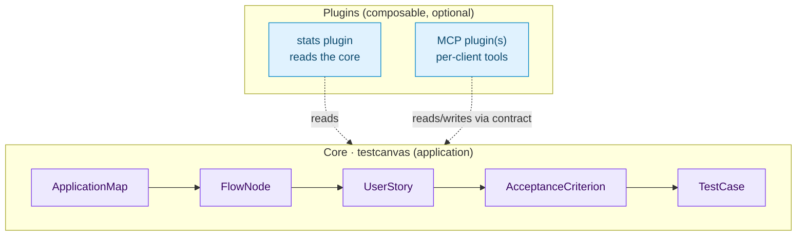

# ISTQB Strategy and Plugin Architecture

This document explains the design philosophy behind TestCanvas: how it models
testing assets following the **ISTQB** methodology, **why the whole ISTQB chain
— including test cases — lives in the core application**, and how the finished
product can still be **extended with optional plugins** according to each
project's needs.

## The big picture

TestCanvas is a test manager whose **core application** captures the full ISTQB
decomposition — from the *test basis* (the description of *what* must be tested)
down to the *test cases* that validate the acceptance criteria — surrounded by a
belt of **optional plugins** that add extra, project-specific capabilities
(metrics, automation interfaces, and so on).



The arrows only ever point **towards the core**: plugins know the core, the core
never knows the plugins.

## The ISTQB strategy

The core models the canonical ISTQB decomposition of the *test basis* down to
the executable test cases:

```
ApplicationMap ──< FlowNode ──< UserStory ──< AcceptanceCriterion >──< TestCase
```

| Layer | ISTQB meaning | Owned by |
|-------|---------------|----------|
| **ApplicationMap / FlowNode** | The application flow that acts as the *test basis* (graph of steps/states). | Core |
| **UserStory** | The behaviour expected at a flow node, in Agile/ISTQB form. | Core |
| **AcceptanceCriterion** | The measurable exit condition (optionally Given-When-Then). | Core |
| **TestCase** | The concrete test that verifies one or more acceptance criteria. | Core |

The job of the core is to **force these artefacts to be written in a coherent,
traceable way**:

- **Vertical traceability by code.** `UserStory.code` is unique and
  `AcceptanceCriterion` is unique per user story, so every criterion traces back
  to exactly one story and one flow node, and every test case traces back to the
  criteria it verifies.
- **Structural invariants on the flow.** `FlowNode.clean()` enforces the
  pure/sub-flow rules (coherent `node_type`, no self-reference, single-level
  nesting, no cycles), keeping the flow graph well-formed.
- **Stable, global identifiers.** Every core artefact carries a compact Base62
  identifier (`flow_uid`, `node_uid`, `user_story_uid`, `ac_uid`) that is stable
  across environments and re-imports.

!!! note "Why the UIDs matter"
    The `*_uid` fields are the **contract** on which plugins attach. A plugin —
    or a per-client MCP tool — anchors to an `ac_uid` or `node_uid`, never to an
    internal primary key. This is what lets the core evolve while plugins keep
    working.

## Test cases are part of the core

A *test case* is the last functional unit of the ISTQB chain, and in TestCanvas
it is a **first-class core model** alongside the test basis it verifies.

| Concern | Test basis (core) | Test case (core) |
|---------|-------------------|------------------|
| **Question answered** | *What* must be validated | *How* the criteria are verified |
| **Coupled to** | Business/functional analysis | The acceptance criteria it covers |
| **Examples of fields** | actor, criterion, flow step | code, description, `tc_uid`, linked criterion |

The core `TestCase` model:

- **Lives in the core `testcanvas` app** (`testcanvas/models.py`).
- Attaches to the test basis through a relation to
  `testcanvas.AcceptanceCriterion`, exposed with the reverse accessor
  `criterion.test_cases`.
- Is managed through core views, URLs (`testcanvas:test_case_*`) and templates,
  and appears in the core traceability views.

```python
# testcanvas/models.py
class TestCase(models.Model):
    acceptance_criterion = models.ForeignKey(
        "testcanvas.AcceptanceCriterion",
        related_name="test_cases",   # core reverse accessor: criterion.test_cases
        on_delete=models.CASCADE,
    )
    # code, description, tc_uid ...
```

### Consequences

- The core traceability views show the full **US → AC → TC** decomposition.
- Coverage over the test basis can be computed directly from core data, without
  any optional plugin installed.
- Tool-specific execution details (Cucumber tags, Allure history IDs, run
  status, report URLs) are **not** part of the core `TestCase`; when a project
  needs them, they belong to an optional execution/reporting plugin that reads
  the core forward and stores its own volatile data.

## The plugin composition philosophy

The strategy is deliberately simple:

> A core application that enforces coherent flows, user stories, acceptance
> criteria and test cases — and everything beyond that is a plugin, composed per
> project.

Anything beyond the ISTQB test basis and its test cases is, in principle,
project-specific and varies with the customer:

- **stats plugin** — reads the core to produce coverage and quality metrics;
  owns no source-of-truth data.
- **execution / reporting plugin** — binds core test cases to a specific
  toolchain (e.g. Cucumber, Allure) and stores tool-specific execution results;
  attaches to core artefacts through their `*_uid`.
- **MCP plugin(s)** — the automation/LLM interface, which **varies by client and
  request**; different customers get different MCP tool sets, all built on the
  same core contract.

### The rules that keep it clean

These rules are what make the architecture composable and safe:

1. **One-way dependencies.** Imports always point at the core; the core never
   imports a plugin.
2. **Reference the core by string.** Cross-app relations use
   `'testcanvas.AcceptanceCriterion'`, never a direct import of a core model.
3. **Anchor on `*_uid`, not primary keys.** Stable identifiers are the join
   point for every plugin and MCP tool.
4. **Register via `INSTALLED_APPS`.** Installing or removing a plugin must not
   require any change to the core.
5. **Degrade gracefully.** A plugin that depends on another must still work —
   with reduced scope — when that dependency is absent (`apps.is_installed(...)`).
6. **The core must run alone.** No core code path may depend on an optional
   plugin being installed.

### How plugins plug into the UI

Plugins integrate with the shared navigation without touching core templates:
each plugin declares its own links in its `AppConfig` (`nav_items` or
`get_nav_items(request)`), and the shared collector renders them automatically.
Plugins can also enrich core object pages through the **object-widget slot**
(see the object-widgets guides) instead of editing core templates.

```python
# my_plugin/apps.py
class MyPluginConfig(AppConfig):
    name = "my_plugin"
    label = "my_plugin"
    nav_items = [
        {"label": "My Plugin", "url_name": "my_plugin:index"},
    ]
```

See [How to Add a Django App to the Shared Navbar](navbar-plugin-setup.md) for
the full, copy-paste-friendly procedure.

## Building a plugin

A plugin (stats, an execution/reporting back-end, a client-specific MCP) follows
one recipe:

- depend on the core, reference core models by string,
- anchor on the `*_uid` identifiers,
- register through `INSTALLED_APPS`,
- add its navbar entry via its `AppConfig`,
- enrich core pages through the object-widget slot rather than editing core
  templates.

!!! tip "Reading the core"
    A plugin reads the core forward (flow nodes, user stories, acceptance
    criteria, test cases) and never relies on the core knowing it exists.

## Summary

| Element | Role | Owner |
|---------|------|-------|
| Flow, User Story, Acceptance Criterion, Test Case + coherence rules | Canonical ISTQB chain | **Core** (application) |
| `*_uid` Base62 identifiers | Stable attach point for plugins | **Core** (contract) |
| Tool-specific execution / Allure reporting | Toolchain-specific results | **Execution plugin** |
| Coverage / aggregated metrics | Reads the core | **Stats plugin** |
| MCP tools | Per-client automation interface | **MCP plugin(s)** |

The result is a **core application** that guarantees coherent, traceable ISTQB
artefacts — flows, user stories, acceptance criteria and test cases — and a
**belt of optional plugins** that each project assembles to build exactly the
test manager it needs.
