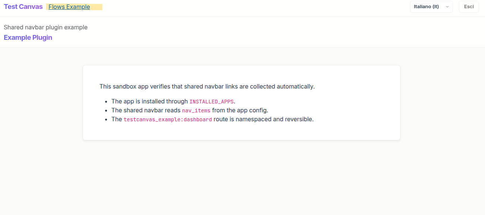

# How to Add a Django App to the Shared Navbar

This guide explains how to make any Django app appear in the shared TestCanvas navbar.

It is designed to be simple, practical, and copy-paste friendly.

## Goal

When an app is installed in `INSTALLED_APPS`, it can declare its own navbar links.
The shared collector automatically reads those declarations and renders them in the navbar.

This means:
- no hardcoded plugin links in the core template,
- no core template edits when adding/removing apps,
- consistent sorting and permission-based visibility.

## Prerequisites

Before adding links:
- your app is a valid Django app,
- your app config class is in `INSTALLED_APPS`,
- your app URL names are namespaced and reversible.

## Step 1 - Add the app to `INSTALLED_APPS`

In `testcanvas_project/settings.py`:

```python
INSTALLED_APPS = [
    # ... existing apps ...
    "testcanvas_example.apps.TestcanvasExampleConfig",
]
```

If the app is not installed, the collector cannot see it.

## Step 2 - Declare navbar items in the app `AppConfig`

Create or update `testcanvas_example/apps.py`:

```python
from django.apps import AppConfig


class TestcanvasExampleConfig(AppConfig):
    default_auto_field = "django.db.models.BigAutoField"
    name = "testcanvas_example"
    label = "testcanvas_example"

    nav_items = [
        {
            "label": "Example",
            "url_name": "testcanvas_example:dashboard",
            "icon": "",
        }
    ]
```

Required fields per item:
- `label` (visible text)
- `url_name` (namespaced URL for `reverse()`)

Optional fields:
- `icon`
- `permission` (Django permission codename)

## Step 3 - Define app URLs with namespace

In `testcanvas_example/urls.py`:

```python
from django.urls import path
from .views import dashboard

app_name = "testcanvas_example"

urlpatterns = [
    path("", dashboard, name="dashboard"),
]
```

The `url_name` in `nav_items` must match this namespace and route name.

## Step 4 - Include app URLs in project routes

In `testcanvas_project/urls.py`:

```python
from django.urls import include, path

urlpatterns = [
    # ... existing routes ...
    path("example/", include("testcanvas_example.urls")),
]
```

## Step 5 - Optional: Add app ordering in settings

Ordering is controlled centrally by `AppConfig.label` in `testcanvas_project/settings.py`:

```python
NAVBAR_APP_ORDER = {
    "testcanvas": 10,
    "testcanvas_example": 20,
}
```

Sorting rules:
- if an app label is configured here, this value wins,
- ties use silent alphabetical order by `AppConfig.label`,
- apps not configured are sorted alphabetically by `AppConfig.label`,
- if the map is empty, all apps are alphabetical by `AppConfig.label`.

## Step 6 - Optional: Permission-based visibility

### Static permission on `nav_items`

```python
nav_items = [
    {
        "label": "Example",
        "url_name": "testcanvas_example:dashboard",
        "permission": "testcanvas_example.view_dashboard",
    }
]
```

If the user does not have the permission, the link is hidden.

### Dynamic links with `get_nav_items(request)`

Use this when visibility or labels depend on the request/user.

```python
from django.apps import AppConfig


class TestcanvasExampleConfig(AppConfig):
    default_auto_field = "django.db.models.BigAutoField"
    name = "testcanvas_example"
    label = "testcanvas_example"

    def get_nav_items(self, request):
        if not request.user.has_perm("testcanvas_example.view_dashboard"):
            return []

        return [
            {
                "label": "Example",
                "url_name": "testcanvas_example:dashboard",
            }
        ]
```

If both `get_nav_items` and `nav_items` exist, the dynamic method is used.

## Step 7 - Add a simple function-based view and template

In `testcanvas_example/views.py`:

```python
from django.contrib.auth.decorators import login_required
from django.shortcuts import render


@login_required
def dashboard(request):
    """Render the example plugin dashboard page."""
    return render(request, "testcanvas_example/dashboard.html")
```

In `testcanvas_example/templates/testcanvas_example/dashboard.html`:

```django


Example Plugin


<div class="container py-4">
    <p>This page is reachable from the shared navbar.</p>
</div>

```

Why this matters:
- `testcanvas/bases/base_page.html` already includes the shared TestCanvas layout,
  including the top navigation bar.
- By extending this base template, your page automatically shows the collected
  navbar items (including your plugin link) without duplicating layout code.
- If you use a different base template, your route may still work but the shared
  navbar may not be visible.



## Defensive Behavior (Important)

The collector is intentionally defensive:
- if a `url_name` cannot be reversed, that link is skipped,
- one broken plugin link does not break the entire navbar.

This is what keeps plugin add/remove operations safe.

## Quick Validation Checklist

- [ ] App config class is listed in `INSTALLED_APPS`.
- [ ] `AppConfig.label` is set and unique.
- [ ] `nav_items` or `get_nav_items(request)` is defined.
- [ ] Every `url_name` is namespaced and reversible.
- [ ] App URLs are included in `testcanvas_project/urls.py`.
- [ ] Optional: app label is added to `NAVBAR_APP_ORDER`.
- [ ] Optional: permission rules are correct.

## Troubleshooting

### Link does not appear
- Check app is in `INSTALLED_APPS` with the correct AppConfig path.
- Check `url_name` matches `app_name:name` exactly.
- Check user permissions if `permission` is set.
- Check for typos in `AppConfig.label` when using `NAVBAR_APP_ORDER`.

### Wrong position in navbar
- Confirm `NAVBAR_APP_ORDER` contains the expected app label.
- If missing, the app is sorted alphabetically by `AppConfig.label`.
- If multiple apps share the same numeric order, tie-break is alphabetical.

### App removed but old link still expected
- Ensure the app is fully removed from `INSTALLED_APPS`.
- The collector only reads currently installed apps.

## Minimal Example Summary

For most plugins, this is enough:
1. add app config to `INSTALLED_APPS`,
2. define `label` and `nav_items` in `apps.py`,
3. define namespaced URL,
4. include app URLs in project `urls.py`.

The shared navbar picks it up automatically.
