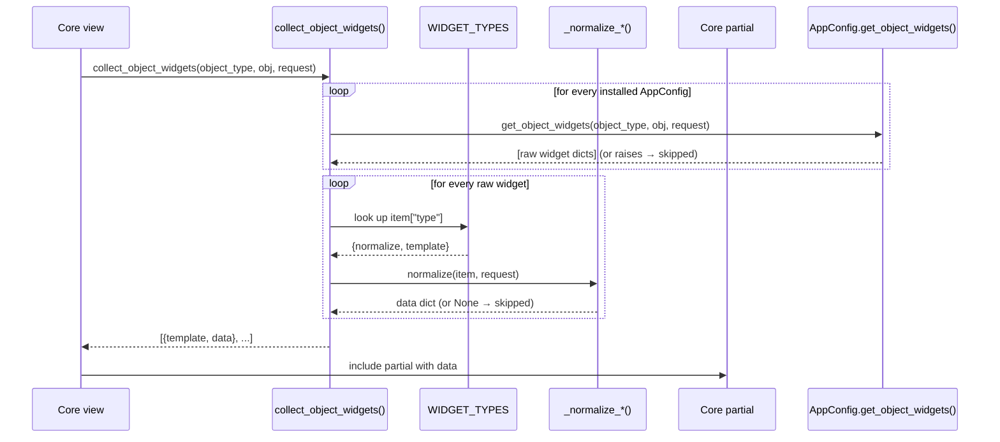
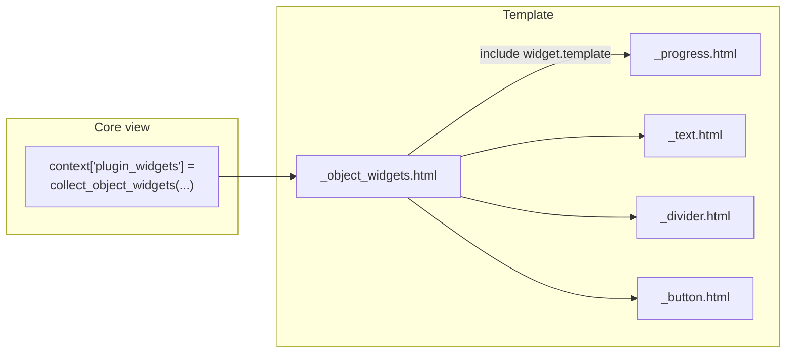
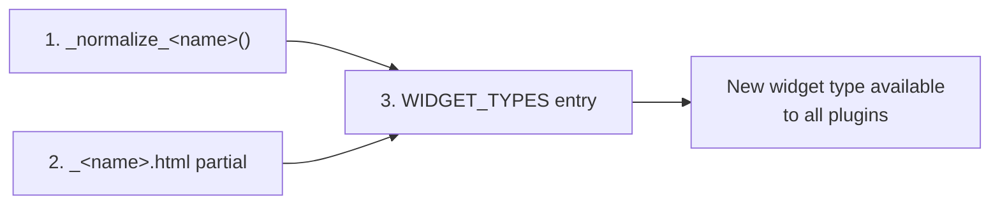

# Object Widgets — Developer Guide

This document explains **how the object-widgets extension point is implemented**
inside the TestCanvas core, so framework developers can maintain it, extend it
with new widget types, or debug it. For the plugin-author perspective (how to
*use* it), read the companion **Object Widgets — User Guide**.

The implementation lives in `testcanvas/plugins.py` and its rendering partials
in `testcanvas/templates/testcanvas/slots/`.

---

## 1. Design goals

The object-widgets mechanism is a **one-way extension contract**:

- Installed Django apps (plugins) may attach ordered UI fragments to a core
  object (`ApplicationMap`, `FlowNode`, `UserStory`, `AcceptanceCriterion`).
- **The core never imports a plugin.** A plugin is enabled or disabled by
  editing `INSTALLED_APPS` alone.
- A plugin declares **structured data** (typed widget dicts), never HTML. The
  core owns URL reversing, permission checks, HTML escaping and Bootstrap
  styling — exactly where the project rules want them.

This mirrors the navbar collector in `testcanvas/context_processors.py`
(`plugin_navbar` / `_normalize_item`): both iterate over every `AppConfig`,
read an optional declaration, and normalise it defensively.

---

## 2. The contract

A plugin declares, on its `AppConfig`, this optional method:

```python
def get_object_widgets(self, object_type, obj, request) -> list[dict]:
    ...
```

- `object_type` — one of `OBJECT_TYPES`.
- `obj` — the concrete core instance being rendered.
- `request` — the current HTTP request (used for permission checks).
- **Return value** — a list of plain widget dicts. Each carries a `type` key
  (one of `WIDGET_TYPES`) plus the fields that type expects. Widgets render in
  list order.

```python
# testcanvas/plugins.py
OBJECT_TYPES = (
    "application_map",
    "flow_node",
    "user_story",
    "acceptance_criterion",
)
```

---

## 3. End-to-end flow



There are three stages: **collect**, **normalise/dispatch**, **render**.

---

## 4. Stage 1 — Collection

`collect_object_widgets(object_type, obj, request)` iterates over every
installed `AppConfig` via `django.apps.apps.get_app_configs()`, looks for a
callable `get_object_widgets` attribute, and calls it.

Key defensive behaviours:

- A config **without** the method is skipped (`callable(getter)` check).
- A provider that **raises** is caught and skipped, so a faulty plugin can never
  break the core render:

```python
try:
    raw_items = getter(object_type, obj, request) or []
except Exception:
    # A broken provider contributes nothing; the core keeps rendering.
    continue
```

The relative order is preserved: widgets from earlier-installed apps come first,
and within one plugin they keep their list order.

---

## 5. Stage 2 — Normalisation & dispatch

Each raw widget is passed to `_normalize_widget`, which:

1. looks up `item["type"]` in the `WIDGET_TYPES` registry;
2. returns `None` for an unknown type (so it is silently dropped);
3. runs the type-specific normaliser;
4. wraps the result with the core partial that renders it.

```python
def _normalize_widget(item, request):
    spec = WIDGET_TYPES.get(item.get("type"))
    if spec is None:
        return None                       # unknown type → skip
    data = spec["normalize"](item=item, request=request)
    if data is None:
        return None                       # invalid payload → skip
    return {"template": spec["template"], "data": data}
```

### The registry

`WIDGET_TYPES` maps each widget `type` to its normaliser and its rendering
partial. **This is the single source of truth** that keeps plugins and the core
agreed on the vocabulary:

```python
WIDGET_TYPES = {
    "progress": {"normalize": _normalize_progress, "template": ".../widgets/_progress.html"},
    "text":     {"normalize": _normalize_text,     "template": ".../widgets/_text.html"},
    "divider":  {"normalize": _normalize_divider,  "template": ".../widgets/_divider.html"},
    "button":   {"normalize": _normalize_button,   "template": ".../widgets/_button.html"},
}
```

### The normalisers

Each `_normalize_*` function validates one raw dict and returns a template-ready
`data` dict (or `None` to skip it). They **never emit HTML**. Highlights:

- `_normalize_progress` — coerces `value`/`max` to floats, rejects
  `max <= 0`, and **clamps the percentage to 0..100** so a stray value can
  never overflow the bar.
- `_normalize_text` — drops the widget when `text` is empty.
- `_normalize_divider` — always accepted (no required field).
- `_normalize_button` — enforces the optional `permission` via
  `request.user.has_perm`, requires `url_name`, and reverses it with
  `django.urls.reverse`, catching `NoReverseMatch` to stay robust if a plugin
  route is missing or renamed.

### Bootstrap safety

`class_type` never becomes arbitrary CSS. `_clean_context` whitelists it against
`BOOTSTRAP_CONTEXTS` and falls back to a per-widget default:

```python
BOOTSTRAP_CONTEXTS = (
    "primary", "secondary", "success", "danger",
    "warning", "info", "light", "dark", "muted",
)

def _clean_context(value, default):
    token = str(value or "").strip()
    return token if token in BOOTSTRAP_CONTEXTS else default
```

The partial then composes the final class (`btn-{context}`, `bg-{context}`,
`text-{context}`), so a plugin can only pick a known, safe variant.

---

## 6. Stage 3 — Rendering

The collector returns a list of `{"template": ..., "data": ...}` dicts. A core
view stores it in the context under `plugin_widgets`, and the shared slot
`testcanvas/slots/_object_widgets.html` renders each one:

```django

    <div class="plugin-widgets">
        
            
        
    </div>

```

The slot **self-hides** when the list is empty, so core templates can include it
unconditionally. Each partial under `slots/widgets/` reads only the validated
`data` dict — see `_progress.html`, `_text.html`, `_divider.html`,
`_button.html`.



---

## 7. Where the core calls it

Core views in `testcanvas/views/standard_views.py` populate `plugin_widgets` for
each relevant object type, for example:

```python
from testcanvas.plugins import collect_object_widgets

context = {
    # ...
    'plugin_widgets': collect_object_widgets('flow_node', flow_node, request),
}
```

It is called for `flow_node`, `user_story`, `acceptance_criterion` and
`application_map` across the flow node, user story, criterion and map views.

---

## 8. Adding a new widget type

Adding a widget type is a **two-step change**, fully contained in the core;
plugins never touch the registry:

1. **Write a normaliser** `_normalize_<name>(item, request)` in `plugins.py`
   that validates the raw dict and returns a template-ready `data` dict (or
   `None`). Reuse `_clean_context` for any Bootstrap token.
2. **Ship a partial** under `templates/testcanvas/slots/widgets/_<name>.html`
   that renders `data` with Bootstrap classes and proper escaping.
3. **Register it** by adding an entry to `WIDGET_TYPES`.



Guidelines:

- Keep the normaliser total: it must accept *any* dict and never raise, always
  returning either a clean `data` dict or `None`.
- Never trust plugin input for styling — always run it through `_clean_context`
  or an equivalent whitelist.
- Do the URL reversing in the normaliser (like `_normalize_button`), never in
  the template.

---

## 9. Reference — key symbols

| Symbol                                   | Location                                     | Role                                   |
| ---------------------------------------- | -------------------------------------------- | -------------------------------------- |
| `OBJECT_TYPES`                           | `testcanvas/plugins.py`                       | Allowed object families                |
| `WIDGET_TYPES`                           | `testcanvas/plugins.py`                       | Type → normaliser + partial registry   |
| `BOOTSTRAP_CONTEXTS`                     | `testcanvas/plugins.py`                       | Whitelisted Bootstrap colour tokens    |
| `collect_object_widgets`                 | `testcanvas/plugins.py`                       | Collector iterating over app configs   |
| `_normalize_widget`                      | `testcanvas/plugins.py`                       | Dispatch to the typed normaliser       |
| `_normalize_progress` / `_text` / `_divider` / `_button` | `testcanvas/plugins.py`       | Per-type validators                    |
| `_clean_context`                         | `testcanvas/plugins.py`                       | Bootstrap token whitelist helper       |
| `_object_widgets.html`                   | `testcanvas/templates/testcanvas/slots/`      | Shared rendering slot                  |
| `widgets/_*.html`                        | `testcanvas/templates/testcanvas/slots/widgets/` | Per-type rendering partials         |

