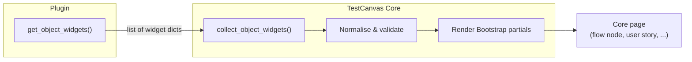
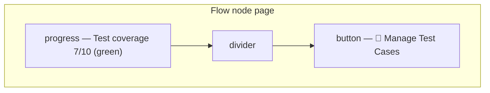
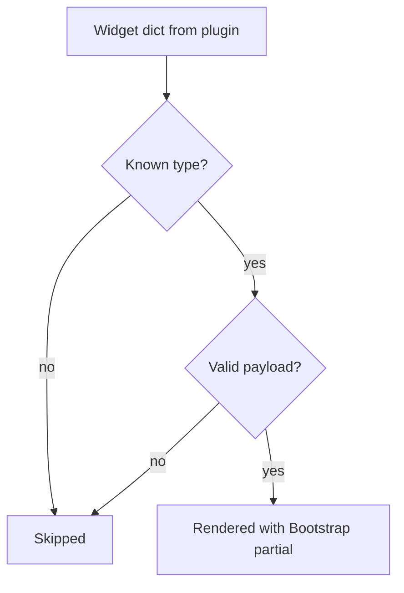

# Object Widgets — User Guide

This guide explains, from a **user / plugin author** point of view, how the
`get_object_widgets` extension point lets an installed plugin add small pieces
of interface (called **widgets**) onto TestCanvas core objects — without ever
touching the core code.

If you want to understand how the mechanism is built internally, read the
companion document **Object Widgets — Developer Guide**.

---

## 1. What object widgets are

A **widget** is a small, self-contained piece of UI that a plugin contributes
to a core page. The core renders it for you using safe, pre-styled Bootstrap
partials. You never write HTML: you only describe *what* you want to show, and
the core decides *how* to show it.

Widgets are attached to a specific **core object family** (an *object type*):

| Object type            | Where it appears                              |
| ---------------------- | --------------------------------------------- |
| `application_map`      | The application map / flow editor header      |
| `flow_node`            | A single flow node page                       |
| `user_story`           | A user story page                             |
| `acceptance_criterion` | An acceptance criterion page                  |

Widgets are rendered **in the order you return them**, so you control the layout
simply by ordering the list.



---

## 2. The four widget types

You can currently contribute four widget types. Each is a plain Python
dictionary with a `type` key plus the fields that type understands.

### 2.1 `progress` — a progress bar with an optional comment

Use it to show a measurable value (coverage, completion, ...).

| Field        | Required | Default   | Meaning                                          |
| ------------ | -------- | --------- | ------------------------------------------------ |
| `type`       | ✅       | —         | Must be `"progress"`                             |
| `value`      | ✅       | —         | Current amount (number)                          |
| `max`        | ❌       | `100`     | Maximum amount                                   |
| `label`      | ❌       | `""`      | Caption shown above the bar                      |
| `class_type` | ❌       | `primary` | Bootstrap colour (`success`, `warning`, `danger`, ...) |
| `show_value` | ❌       | `True`    | Print the percentage inside the bar              |
| `title`      | ❌       | `""`      | Tooltip on the whole widget                      |

```python
{
    "type": "progress",
    "label": "Test coverage",
    "value": 7,
    "max": 10,
    "class_type": "success",
}
```

### 2.2 `text` — a short caption or note

| Field        | Required | Default | Meaning                              |
| ------------ | -------- | ------- | ------------------------------------ |
| `type`       | ✅       | —       | Must be `"text"`                     |
| `text`       | ✅       | —       | The content to show                  |
| `icon`       | ❌       | `""`    | Glyph shown before the text          |
| `class_type` | ❌       | `muted` | Bootstrap text colour                |
| `strong`     | ❌       | `False` | Render bold                          |

```python
{
    "type": "text",
    "icon": "ℹ️",
    "text": "Coverage is computed from linked test cases.",
}
```

### 2.3 `divider` — a separator line

Use it to group your widgets into tidy sections. It has no required field.

| Field   | Required | Default | Meaning                          |
| ------- | -------- | ------- | -------------------------------- |
| `type`  | ✅       | —       | Must be `"divider"`              |
| `label` | ❌       | `""`    | Optional caption centered on it  |

```python
{"type": "divider"}
{"type": "divider", "label": "Actions"}
```

### 2.4 `button` — an action link styled as a Bootstrap button

The core reverses the URL for you (you pass a **URL name**, never a hard-coded
URL) and can hide the button behind a permission.

| Field        | Required | Default     | Meaning                                        |
| ------------ | -------- | ----------- | ---------------------------------------------- |
| `type`       | ✅       | —           | Must be `"button"`                             |
| `label`      | ✅       | —           | Visible text                                   |
| `url_name`   | ✅       | —           | Django URL name to reverse                     |
| `args`       | ❌       | `[]`        | Positional args for the URL                    |
| `kwargs`     | ❌       | `None`      | Keyword args for the URL                       |
| `icon`       | ❌       | `""`        | Glyph shown before the label                   |
| `class_type` | ❌       | `secondary` | Bootstrap button colour                        |
| `htmx`       | ❌       | `False`     | Fire the URL via `hx-get` instead of navigating |
| `target`     | ❌       | `""`        | `hx-target` selector for the HTMX variant      |
| `permission` | ❌       | `None`      | Django permission required to see the button   |

```python
{
    "type": "button",
    "label": "Manage Test Cases",
    "url_name": "testcanvas_test_execution:test_case_manage",
    "args": [obj.pk],
    "icon": "🧪",
    "class_type": "primary",
}
```

---

## 3. How to contribute widgets

Add a `get_object_widgets` method to your plugin's `AppConfig`. The core calls
it for every core object it renders and passes you three arguments:

- `object_type` — one of the object types in the table above,
- `obj` — the concrete core instance being rendered,
- `request` — the current HTTP request (used for permission checks).

Return a **list of widget dicts**. Return an empty list when you have nothing to
show for that object.

```python
from django.apps import AppConfig


class MyPluginConfig(AppConfig):
    name = "my_plugin"

    def get_object_widgets(self, object_type, obj, request):
        # Only enrich flow nodes; ignore everything else.
        if object_type != "flow_node":
            return []

        return [
            {
                "type": "progress",
                "label": "Completion",
                "value": 40,
                "class_type": "warning",
            },
            {"type": "divider"},
            {
                "type": "button",
                "label": "Open details",
                "url_name": "my_plugin:details",
                "args": [obj.pk],
                "class_type": "primary",
            },
        ]
```

That's it — install the app in `INSTALLED_APPS` and the widgets appear. No core
file needs to change.

---

## 4. A complete real example

The bundled **Test Execution** plugin contributes a coverage bar and a
"Manage Test Cases" button to each flow node, and a coverage bar to the whole
map. This is what its `get_object_widgets` produces for a flow node:



The colour of the bar changes with the value: green at ≥ 80%, yellow at ≥ 50%,
red below. The button only appears on flow nodes, because maps have no per-node
test-case page.

---

## 5. Good to know (safety rules)

The core protects itself and you:

- **A broken plugin never breaks the page.** If your `get_object_widgets`
  raises, the core silently skips it and keeps rendering.
- **Unknown widget types are ignored.** If you misspell `type`, that widget is
  dropped instead of breaking the layout.
- **You cannot inject arbitrary CSS or HTML.** `class_type` only accepts a
  whitelist of Bootstrap colours; everything else is escaped by the core.
- **Invalid buttons are dropped.** A missing `url_name`, an unreversible URL, or
  a failed permission check simply hides that button.
- **The slot self-hides.** If no plugin contributes anything, no empty area is
  shown.



---

## 6. Checklist before shipping a widget

- [ ] `get_object_widgets` is defined on your `AppConfig`.
- [ ] It returns a **list of dicts** (empty list when nothing to show).
- [ ] Each dict has a valid `type` (`progress`, `text`, `divider`, `button`).
- [ ] Buttons pass a `url_name` (never a hard-coded URL).
- [ ] `class_type` uses a Bootstrap colour token only.
- [ ] Widgets are ordered the way you want them to appear.
- [ ] Your app is listed in `INSTALLED_APPS`.

